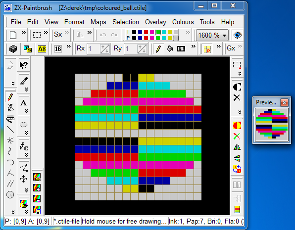

# ZX Spectrum Development with Z88DK - BiFrost

This is the seventh document in the series which describes how to get started
writing ZX Spectrum programs using Z88DK. As before, it concerns itself only
with the newer, more standards compilant zsdcc C compiler. Neither the original
sccz80 compiler nor the classic library is discussed.

This document covers the BiFrost library which provides multicolour graphics
support for Spectrum programs. Although this might be considered a rather niche
topic, the discussion also covers other aspects of Z88DK which will be referred
to in future installments. We introduce separately loaded libraries and the
BASIC loader required to load them, more advanced appmake usage, and a
makefile. The reader is encouraged to read the document even if they have no
particular interest in BiFrost.

## Assumptions

It is assumed the reader has worked through the earlier installments of this
series and is continuing on from [installment 6](https://github.com/z88dk/z88dk/blob/master/doc/ZXSpectrumZSDCCnewlib_06_SomeDetails.md).

If you would like to jump to the beginning, click on [installment 1](https://github.com/z88dk/z88dk/blob/master/doc/ZXSpectrumZSDCCnewlib_01_GettingStarted.md).

## Z88DK's BiFrost Library

[BiFrost](http://www.worldofspectrum.org/infoseekid.cgi?id=0027405)
is a multicolour graphics library written by
[Einar Saukas](https://www.ime.usp.br/~einar/bifrost/), which has
been embedded into, and interfaced with, the Z88DK C development
kit. "Multicolour" means it's capable of drawing blocks of pixels which are 8
pixels wide by 1 pixel high, each with 2 colour attributes. This works much the
same way as the Spectrum's native 8x8 pixel blocks which have the INK and PAPER
attributes, but since BiFrost's blocks occupy 1 pixel row instead of 8, the
programmer can get a much more colourful display.

There are 2 versions of BiFrost: the original and BiFrost*2. Somewhat
confusingly, the original BiFrost also comes in 2 versions, low resolution and
high resolution. Which of the 3 versions you chose depends on what capabilities
you require.

## Understanding BiFrost's Capabilities

---

**_This section introduces the BiFrost concept of 'tiles'. If you've already
read the [SP1](https://github.com/z88dk/z88dk/blob/master/doc/ZXSpectrumZSDCCnewlib_SP1_02_SimpleMaskedSprite.md)
part of this guide you'll know that SP1 also has the concept
of 'tiles'. It's somewhat unfortunate and confusing that the two graphics
libraries use the same term for different things. As we're about to see,
BiFrost uses the term 'tile' for a 16x16 pixel graphical object which it can
place on the screen. SP1 uses the term 'tile' for an 8x8 pixel character
cell, a grid of which makes up the background image SP1 draws onto. If
you're already familiar with SP1, make sure you keep the concepts of 'tiles'
separate in your head. They're different entities in these two libraries._**

---

BiFrost places coloured _tiles_ within its display area. Although tiles can be
animated and moved around to some extent, they're not the _sprite_ type of
graphics which you might think of as floating freely around the screen. BiFrost
isn't suitable for Space Invaders, but it will help you to write puzzle games
like Tetris, board games, strategy and turn playing games, and will do so
providing a level of colour which the Spectrum shouldn't really be capable of.

Technical limitations mean BiFrost can't use the whole screen. It's restricted
to 18 character rows by 18 character columns. That's 144x144 pixels, as seen in
green:


The low resolution version of BiFrost can place a 16x16 pixel multicolour "tile"
at 16 pixel boundaries, i.e. aligned to every other character location. The high
resolution version of BiFrost can place a multicolour tile at any vertical pixel
aligned to 8 pixel horizonal coordinates, at the expense of more memory
consumption and greater CPU processing requirement over the low resolution
version.

BiFrost*2 is an improvement on the high resolution version of BiFrost. It can
place a 16x16 pixel multicolour tile at any vertical pixel, on any 8 pixel
horizontal boundary, and can do so within a 20x22 character grid. That's a
160x176 pixel area of the screen.

## A BiFrost Program BASIC Loader

BiFrost based programs created with Z88DK LOAD in a slightly different way to
most Spectrum programs. The compliation process generates _two_ blocks of
machine code. The first is the programmer's code, the compiled C, as usual. The
second is the BiFrost library itself, which needs to be loaded separately into a
specifically allocated area of high memory. The details of why aren't really
important at this getting started level. The important thing is to understand
the loading process the Spectrum will have to go through:

* load and run a BASIC loader
* the BASIC loader loads the programmer's CODE into memory
* the BASIC loader then loads the BiFrost library CODE into higher memory
* the BASIC loader then runs the programmer's code

The programmer's code, created by Z88DK, expects to find the BiFrost library
loaded and waiting to be run at the correct address. (BiFrost  has to be loaded
at an exact memory location otherwise it won't work.) As long as the BASIC loader
has loaded BiFrost into the correct area of memory this will work as expected.

Step 1, therefore, is to create a BASIC loader program. Yes, you're going to
type a bit of Spectrum BASIC. Here it is:

```
10 CLEAR 32767
20 LOAD "" CODE
30 LOAD "" CODE
40 RANDOMIZE USR 32768
```

This needs to be saved to a .TAP file. The exact steps for doing this depend on
the emulator you're using. On Fuse you would use Media->Tape->Clear to clear the
emulator's "virtual tape", then save the program with:

```
SAVE "biloader" LINE 10
```

Once that's complete, write out the "virtual tape" to a file called
bifrost_loader.tap using Media->Tape->Write. That's the loader part completed.

## Create a ctile

A _ctile_ in BiFrost terminology is a 16x16 pixel graphic which can be thought
of as being divided into 2 columns of 8 bits each, by 16 rows high. Each of
these 8 pixel wide by 1 pixel high blocks can have two colours - like INK and
PAPER in traditional Spectrum terms.

The ctile data format is very simple: 32 bytes of bitmap data followed by 32
bytes of attribute data. Even so, a graphical editor makes life a lot easier
when designing tiles, and [ZX
Paintbrush](http://www.zx-modules.de/zxpaintbrush/zxpaintbrush.html) supports
them natively. Sadly, from a Linux user's perspective, this is a Windows-only
tool. although it does appear to run under WINE.

This author used a Windows virtual machine to run it, and stretching his
artistic abilities to the absolute limit, created the coloured ball seen below:



Details on how to use ZX Paintbrush to save ctiles are
[here](https://www.worldofspectrum.org/forums/discussion/40773/redirect/p1). In
short, ZX Paintbrush saves ctiles in a 16KB file containing 256 tiles, so all
your tiles would normally be saved and loaded via a single file. For this
example we only needed a single ctile, so the 64 byte file was created using ZX
Paintbrush's export function, which will create a ctile file containing a single
ctile.

## Load the ctile into an Assembly File

There are several ways to get the 64 bytes of ctile data into a Z88DK program. A
C array containing the relevant bytes is probably easiest, but not the most
flexible since you'd have to change the array each time you update your
graphic. An alternative, which we use in this example, is to create an assembly
language file like this:

```
SECTION rodata_user

PUBLIC _ctiles

_ctiles:

   BINARY "coloured_ball.ctile"
```

Save that to a file called ctile.asm. It creates a symbol for the ctile data
called __ctiles_, the leading underscore of which exports it so it's visible to
the C program, as we'll see in a moment.

The assembler's BINARY command loads the binary data from the named file, which
is the output from ZX Paintbrush. For those following along, the ctile file is
available
[here](https://github.com/z88dk/z88dk/tree/master/doc/resources/coloured_ball.ctile)

### A Simple BiFrost Program - Low Resolution

Step 3 is to create a small program which uses BiFrost. Save this to
bifrost_01.c:

```
#pragma output REGISTER_SP  = -1
#pragma output CLIB_MALLOC_HEAP_SIZE = 0

#include <arch/zx.h>
#include <arch/zx/bifrost_l.h>

extern unsigned char ctiles[];

int main()
{
  unsigned char blank_tile_index;
  unsigned char row, col;

  BIFROSTL_resetTileImages(_ctiles);

  for(blank_tile_index = 0; blank_tile_index < 81; blank_tile_index++) {
    BIFROSTL_tilemap[blank_tile_index] = BIFROSTL_DISABLED;
  }

  zx_cls(PAPER_WHITE);

  for(row = 1; row <=17; row++)
    for(col = 1; col <= 17; col+=2)
      BIFROSTL_fillTileAttrL(row, col, INK_WHITE+PAPER_WHITE);

  BIFROSTL_setTile(0, 0, 0+BIFROSTL_STATIC);

  BIFROSTL_start();

  while(1); 
}
```

The C program references the external symbol _ctiles_ which the C compiler
changes to include a leading underscore `_ctiles` when it translates the C
to assembler.  `_ctiles` is the tile data that the assembly language file
makes available. That is, the ctile data is
the graphics tile data the program can use and place on the screen. Bifrost is
told to change its tile images area to the location of this ctile using the
BIFROSTL_resetTileImages() function. The tile images area can hold up to 256 tiles,
although in this example
only the first tile, tile 0, is used - the coloured ball. (In this example we
add the constant value BIFROSTL_STATIC to the tile index. This is an indicator
to the BiFrost engine that that we don't want BiFrost to animate the tile, which
is a topic we're not covering here.)

The BiFrost tile map is the in-memory representation of what's on the
screen. Set a value in this array and the BiFrost engine will magically render a
tile onto the screen. More specifically, the BIFROSTL_tilemap has 81 entries,
representing the 9x9 tile grid. Each entry holds the index into the tile images
data area (as set by the BIFROSTL_resetTileImages() call earlier) of the tile to
render in that screen location. So if you set BIFROSTL_tilemap[0] to 0, the
first tile in the tile images will appear in the top left corner of the BiFrost
display. Set that array entry to the value BIFROSTL_DISABLED and the tile will
disappear again. Thus you control the tiles shown onscreen by changing the
values in the BIFROSTL_tilemap array.

We start our example by reseting all the BIFROSTL_tilemap entries to
BIFROSTL_DISABLED which ensures no tiles are rendered to start with, then we set
the attributes of the display area to all white.

We then place our single tile, the coloured ball (index 0 in our tiles image
data array, plus a value which indicates to the engine that this tile shouldn't
be animated), at position 0,0 which is the top left corner. With everything in
place we then fire up the BiFrost engine and go into an infinite loop. (If we
return to BASIC BiFrost stops.)

If you change the line:

```
BIFROSTL_setTile(0, 0, 0+BIFROSTL_STATIC);
```

to:

```
BIFROSTL_setTile(1, 1, 0+BIFROSTL_STATIC);
```

and rebuild, you'll see that the ball tile is now placed a complete tile's width
and height further down and along the display - i.e. 16 pixels further in each
direction. This is the restriction of working with the low resolution BiFrost
library: it works in full tile coordinates, which are 16 pixels wide.

You may want to check out the available BIFROSTL functions in the
[header file](https://github.com/z88dk/z88dk/blob/master/include/_DEVELOPMENT/sdcc/arch/zx/bifrost_l.h).

This example program has 2 pragma instructions at the top. These are important,
as we'll see in a few moments. First, we need to see how to build this program.

### Building the Program

We can compile our little program with this:

```
zcc +zx -vn -startup=31 -clib=sdcc_iy bifrost_01.c ctile.asm -o bifrost_01
```

We use crt31 since we're not using Z88DK's standard IO. Also note there's no
specific mention of the BiFrost library on the compile line. For Spectrum
programs Z88DK's standard library makes BiFrost available automatically.

Once this has run you'll notice it's created _two_ binary files in the local
directory:

```
bifrost_01_CODE.bin
bifrost_01_BIFROSTL.bin
```

The first of those is programmer's code, the second is the BiFrost library. The
generation of 2 separate files is a feature of the linker and how it responds to
the way BiFrost is implemented in Z88DK. For now just accept that that's the way
it does it. These files contain raw machine code, so we need to convert them
into .TAP files which the Spectrum can load via the BASIC loader we've already
created. In previous examples we've used zcc's -create-app option to do this
step, but since we're now working with multiple code files which are beyond
zcc's remit we need to do it manually.

The command to convert a binary machine code file to a .TAP file is _appmake_
and for our piece of code we build a command as follows.

Our target machine, as ever, will be a ZX Spectrum:

```
appmake +zx ...
```

Our binary input file is bifrost_01_CODE.bin:

```
appmake +zx -b bifrost_01_CODE.bin ...
```

and the output file will be bifrost_01_code.tap:

```
appmake +zx -b bifrost_01_CODE.bin -o bifrost_01_code.tap ...
```

By default the appmake utility produces a little BASIC loader program to load
machine code. In this case we've already written our own, so we need to suppress
that:

```
appmake +zx -b bifrost_01_CODE.bin -o bifrost_01_code.tap --noloader ...
```

Next we need to specify where the piece of code will be LOADed. This value goes
into the tape header so when you type _LOAD "" CODE_ (i.e. without a specific
load address) the Spectrum can work out where in memory it's expected to load
the code. By default Z88DK compiled code expects to load and run from address
32768, so:

```
appmake +zx -b bifrost_01_CODE.bin -o bifrost_01_code.tap --noloader --org 32768 ...
```

Finally we need to provide a name for the block of CODE on the tape:

```
appmake +zx -b bifrost_01_CODE.bin -o bifrost_01_code.tap --noloader --org 32768 --blockname bifrost_01_code
```

We have to create two pieces of tape loadable code for our BiFrost project, the
second containing the BiFrost code which expects to load and run from address
58625. So the two commands to create the .TAP files are:

```
appmake +zx -b bifrost_01_CODE.bin -o bifrost_01_code.tap --noloader --org 32768 --blockname bifrost_01_code
appmake +zx -b bifrost_01_BIFROSTL.bin -o bifrostl.tap --noloader --org 58625 --blockname bifrostl
```

Finally, we need to merge our 3 tape files into a single one. The .TAP format is
a very simple one which allows direct concatenation of .TAP files in order to
make a single big one, so on Linux the command is:

```
cat bifrost_loader.tap bifrost_01_code.tap bifrostl.tap > bifrost_01.tap
```

This is all a bit fussy to keep typing, so maybe it's time for a makeifle:

```
all: bifrost_01.tap

bifrost_01_CODE.bin: bifrost_01.c ctile.asm coloured_ball.ctile
	zcc +zx -vn -startup=31 -clib=sdcc_iy bifrost_01.c ctile.asm -o bifrost_01

bifrost_01_code.tap: bifrost_01_CODE.bin
	appmake +zx -b bifrost_01_CODE.bin -o bifrost_01_code.tap --noloader --org 32768 --blockname bifrost_01_code
	appmake +zx -b bifrost_01_BIFROSTL.bin -o bifrostl.tap --noloader --org 58625 --blockname bifrostl

bifrost_01.tap: bifrost_01_code.tap
	cat bifrost_loader.tap bifrost_01_code.tap bifrostl.tap > bifrost_01.tap
```

Clearly this makefile could be made more streamlined, or more generic, but it
works for this example. Save this to a file called 'makefile' and run 'make'
(assuming GNU make is installed). The resultant TAP file will place a ball
towards the top left corner of the screen.

### Memory Map and the Pragmas

The example program has 2 pragma instructions to the compiler at the top. The
use of pragmas was covered in
[installment 6](https://github.com/z88dk/z88dk/blob/master/doc/ZXSpectrumZSDCCnewlib_06_SomeDetails.md)
of this series. Of more interest is _why_ they are needed here.

Without the pragmas the memory map of the program, together with the BiFrost
library, would look like this:

```
...
|               |
|---------------|
|0xFF58  65368  | Z88DK program's stack
|---------------| Grows downwards, remember!
|0xFF51  65361  |
|               | BiFrost 81 byte tile map
|0xFF01  65281  |
|---------------|                    
|0xFF00  65280  |
|              X| BiFrost Library
|0xE501  58625 X|
|--------------X|
|XXXXXXXXXXXXXXX|
|XXXXXXXXXXXXXXX| Z88DK heap memory
|XXXXXXXXXXXXXXX|
|XXXXXXXXXXXXXXX|
|---------------|
|               | Z88DK BSS section  (CRT_BSS_DATA)
|               | Z88DK DATA section (CRT_ORG_DATA)
|---------------| ^^^
|               |
|0x8000  32768  | Z88DK compiled C   (CRT_ORG_CODE)
|---------------|
|               |
...
```

The example program is loaded at address 32768 as is usual for Z88DK
programs. The BiFrost library is very particular about where it's loaded. It
occupies the bytes from 58625 to 65280, inclusive. By default, the BiFrost tile
map, which is the 81 byte map which BiFrost uses to map which tiles are
onscreen, goes at address 65281. (See the __BIFROSTL_TILE_MAP entry in the
[default BiFrost low resolution configuration
file](https://github.com/z88dk/z88dk/blob/master/libsrc/_DEVELOPMENT/target/zx/config/config_bifrost_l.m4)).
Those tiles occupy the 81 bytes from 65281 to 65361 inclusive. But look where
Z88DK puts the program's stack by default: [address
65368](https://github.com/z88dk/z88dk/blob/master/libsrc/_DEVELOPMENT/target/zx/crt_config.inc#L28). That's
only 7 bytes above the tile map, which means the stack is bound to overwrite the
tile map data as it grows downwards.

So the first thing we have to do is move the stack somewhere safer, where it's
got a bit of room to grow. That's what the REGISTER_SP pragma does, and as we
saw in [installment 6](https://github.com/z88dk/z88dk/blob/master/doc/ZXSpectrumZSDCCnewlib_06_SomeDetails.md),
setting it to -1 leaves the stack pointer where the BASIC loader puts it, which
in our case is address 32767, safely below our program:

```
...
|             |
|-------------|
|             |
|-------------|
|0xFF51  65361|
|             | BiFrost 81 byte tile map
|0xFF01  65281|
|-------------|
|0xFF00  65280|
|             | BiFrost Library
|0xE501  58625|
|-------------|
|             |
|             | Z88DK heap memory
|             | (error - negative size)
|             |
|-------------|
|             | Z88DK BSS section  (CRT_BSS_DATA)
|             | Z88DK DATA section (CRT_ORG_DATA)
|-------------| ^^^
|             |
|0x8000  32768| Z88DK compiled C   (CRT_ORG_CODE)
|-------------|
|0x7FFF  32767| Z88DK program's stack
|             |
...
```

The other thing we need to consider with this example is the heap. The heap
normally fills the area between the top of the program's BSS area and the
stack. Since we've moved the stack _below_ the BSS area, that would result in a
heap of negative size. As discussed
[here](https://www.z88dk.org/wiki/doku.php?id=temp:front#crt_configuration),
Z88DK doesn't like that and will exit the program immediately if that's how it's
set up. We get round it in this example by simply setting the heap size to zero
bytes, which is what the second pragma instruction does. If your program does
need a heap you'll need to use the pragma to specify how big it needs to
be. But don't get greedy - if your program, plus its DATA and BSS sections, plus
its heap, all reach up beyond address 58625 your heap will wipe out the BiFrost
library. That will not end well when your program calls it.

#### High Resolution BiFrost

Let's take a brief look at the two high resolution variants of the BiFrost
library. These are BiFrost_h and BiFrost*2. As far as the programming interface
is concerned there isn't a great deal of difference in the use of these variants
over the use of the low resolution variant. All the principles we've discussed
so far apply in the same way. The main differences are coordinate specification
in the code and how much memory the library code takes up.

Here's an updated version of our low resolution, bifrost_01.c program, reworked
for the BiFrost high resolution library:

```
#pragma output REGISTER_SP  = -1
#pragma output CLIB_MALLOC_HEAP_SIZE = 0

#include <string.h>
#include <arch/zx.h>
#include <arch/zx/bifrost_h.h>

extern unsigned char ctiles[];

int main()
{
  unsigned char line, col;

  BIFROSTH_resetTileImages(_ctiles);

  memset(BIFROSTH_tilemap, BIFROSTH_DISABLED, 81);

  zx_cls(PAPER_WHITE);

  for(line = 0; line <=160; line++)
    for(col = 0; col <= 18; col++)
      BIFROSTH_fillTileAttrH(line, col, INK_WHITE+PAPER_WHITE);

  BIFROSTH_setTile(4, 4, 0+BIFROSTH_STATIC);

  BIFROSTH_start();

  line = 0;
  col = 1;
  while(1) {
    BIFROSTH_halt();

    if( line != 16 )
      line++;

    BIFROSTH_drawTileH(line,     col, 0);
    BIFROSTH_drawTileH(160-line, col, 0);
  }

}
```

and its makefile:

```
all: bifrost_02.tap

bifrost_02_CODE.bin: bifrost_02.c ctile.asm coloured_ball.ctile
	zcc +zx -vn -startup=31 -clib=sdcc_iy bifrost_02.c ctile.asm -o bifrost_02

bifrost_02_code.tap: bifrost_02_CODE.bin
	appmake +zx -b bifrost_02_CODE.bin -o bifrost_02_code.tap --noloader --org 32768 --blockname bifrost_02_code
	appmake +zx -b bifrost_02_BIFROSTH.bin -o bifrosth.tap --noloader --org 57047 --blockname bifrosth

bifrost_02.tap: bifrost_02_code.tap
	cat bifrost_loader.tap bifrost_02_code.tap bifrosth.tap > bifrost_02.tap
```

Let's just look at the updates we've made for high resolution mode.

The main difference is the screen location positioning. The set tile function works the
same way as with the low resolution code:

```
BIFROSTH_setTile(4, 4, 0+BIFROSTH_STATIC);
```

This sets the centre tile's entry in the memory map containing the tiles to be
displayed. The ball appears in the middle of the 9x9 grid of 16x16 pixel tiles,
just as before.

However, the function _BIFROSTH_drawTileH(line, col, tile_index)_ works
differently. Firstly, it updates the screen directly. It doesn't work by setting
a value in the tile map and letting the BiFrost engine do the rendering, it
draws a tile directly into the display. Because BiFrost is precisely
synchronised with the Spectrum's interrupt, and the BIFROSTH_drawTileH function
must not be interrupted, it must be called directly after waiting for the
interrupt, hence the BIFROST_halt function call.

Also note the line numbering (Y-axis) for both the attribute fill and the tile
drawing is based on 160 vertical lines. That's pixel level positioning in the
Y-axis. The columns are 0 to 18, so tiles can be placed on 8 pixel boundaries,
which is better than the low resolution variant of BiFrost which places tiles on
16 pixel horizontal boundaries.

One more thing: the positioning coordinate values for the high resolution
variant of BiFrost start _outside_ the display area! Y position 0 is 16 pixels
_above_ the display area, which means a tile placed there won't be shown. Column
0 is off the left side of the display as well. This approach was chosen so a
tile can be placed off the edge of the display and moved into the display a
pixel at the time vertically, or a character cell at a time
horizontally. The example above slides the top and bottom tiles into the
display a pixel at the time. Many BiFrost programs which take advantage of this
approach place a border around the BiFrost display area. This border is
typically one character cell wide and has the INK and PAPER set the same. This
hides any artefacts caused by partially visible tiles being outside the area
BiFrost controls.

In the makefile you'll see that the BiFrost high resolution library has to be
loaded at location 57047, so it costs you about 1.5KB over the low resolution
version.

#### BiFrost*2

BiFrost*2 is an advancement on the BiFrost concept, released 4 years after the
original BiFrost. It's implemented to support the same pixel/character block
level tile positioning (vertically and horizontally, respectively) as BiFrost's
high resolution implementation, only it can do so in a 20x22 character cell
grid. That's 160 pixels wide by 176 pixels deep:


At 13KB the library is considerably larger than the high resolution variant of
BiFrost, although you can reduce its display size by tweaking its [library build
time](https://github.com/z88dk/z88dk/blob/master/libsrc/_DEVELOPMENT/target/zx/config/config_bifrost_2.m4)
options. By default it loads at address 51625.

Here's an example which animates our ball twice, once vertically and once
horizontally:

```
#pragma output REGISTER_SP  = -1
#pragma output CLIB_MALLOC_HEAP_SIZE = 0

#include <string.h>
#include <arch/zx.h>
#include <arch/zx/bifrost2.h>

extern unsigned char ctiles[];

int main()
{
  unsigned char line, col;

  zx_border(INK_BLACK);

  BIFROST2_install();

  BIFROST2_resetTileImages(_ctiles);

  memset(BIFROST2_tilemap, BIFROST2_DISABLED, 110);

  zx_cls(PAPER_WHITE);

  for(line = 0; line <=192; line++) {
    for(col = 0; col <= 20; col++) {
      BIFROST2_fillTileAttrH(line, col, INK_WHITE+PAPER_WHITE);
    }
  }

  BIFROST2_start();

  col = 0;

  while(1) {
    for( line=0; line<=192; line++ ) {

      BIFROST2_halt();

      BIFROST2_fillTileAttrH(line-1,10,INK_WHITE+(8*INK_WHITE));
      BIFROST2_drawTileH(line, 10, 0);

      BIFROST2_fillTileAttrH(80,col-1,INK_WHITE+(8*INK_WHITE));
      BIFROST2_drawTileH(80, col, 0);
      if( ++col == 21 )
        col = 0;
    }  
  }
}
```

This is very similar to the BiFrost high resolution code, except the line and
column positioning is tweaked to access the larger display area of
BiFrost2. You will also notice the _BIFROST2_install()_ function call at the
top. BiFrost2 needs to initialise itself differently depending on the Spectrum
model it finds itself running on.

When you run this you'll also notice the artefacts the horizontally moving ball
leaves just off the sides of the BiFrost*2 display area. This is where the
trick of using the border with the same colour INK and PAPER as described above
comes in handy.

As an extra bonus at the end of this article, let's skip the makefile and use a
different approach for building. Use these commands to build the example:

```
zcc +zx -vn -m -startup=31 -clib=sdcc_iy bifrost_03.c ctile.asm -o bifrost_03
appmake +glue -b bifrost_03 --filler 0 --clean
appmake +zx -b bifrost_03__.bin --org 32768 --blockname bifrost_03 -o bifrost_03.tap
```

The -m option to zcc causes it to output a _map_ file. The map is a text file
containing the addresses of all the symbols the compiler encountered in generating its
output. You can use it to find the location of main(), BiFrost, the tile
buffers, etc., which can be useful when working with a disassembler, debugger or
memory monitor. In this build, the first run of appmake uses the +glue target
and (by implication) the map file to generate a single binary file containing the C
program and the BiFrost*2 library. It _glues_ the two binary pieces together,
filling the hole between them with zeroes. This negates the need for the BASIC
loader we've used throughout the examples, which loads two pieces of CODE. The
second call to appmake takes this one large binary file and wraps a standard
BASIC loader around it.

The +glue approach is much less fussy than building the two separate binary
files and a special BASIC loader to get them into place. The drawback is the
much larger LOADable file, which is mainly full of zeroes. With emulators this
isn't a problem as loading from "tape" is instantaneous, so +glue is the best
option for development work.


### Conclusion

This has been a long and rather complicated story. BiFrost is clever software
which opens up a whole host of possibilities for the Spectrum programmer, and
its interface with Z88DK makes it available for C programmers.

BiFrost is also rather involved and complex to deal with; we've used this
complexity to introduce a host of new concepts, features and approaches which
the Z88DK programmer will hopefully find useful as we move forward.


### Where To Go From Here

Given this basic understanding of how Z88DK and BiFrost work together, the Z88DK
BiFrost examples are the next logical step. They're
[here](https://github.com/z88dk/z88dk/tree/master/libsrc/_DEVELOPMENT/EXAMPLES/zx).

The [advanced tutorials](https://www.ime.usp.br/~einar/bifrost/), from the
BiFrost author, describe further possibilities, including animation and
pre-shifted tiles for horizontal pixel level precision. The timing contraints of
BiFrost need to be explored and understood before the library can be expertly
employed.

Even if BiFrost isn't your thing, the lessons learned here will be useful going
forward. With resources so limited every byte matters in Spectrum programs, and
it's an unforgiving environment. Get anything wrong and the program will
crash. The programmer needs to adopt a mindset where he or she sees the complete
picture.

The next part of this getting started guide looks at using the Spectrum's
interrupt with Z88DK.
Part 8 is [here](https://github.com/z88dk/z88dk/blob/master/doc/ZXSpectrumZSDCCnewlib_08_Interrupts.md)
