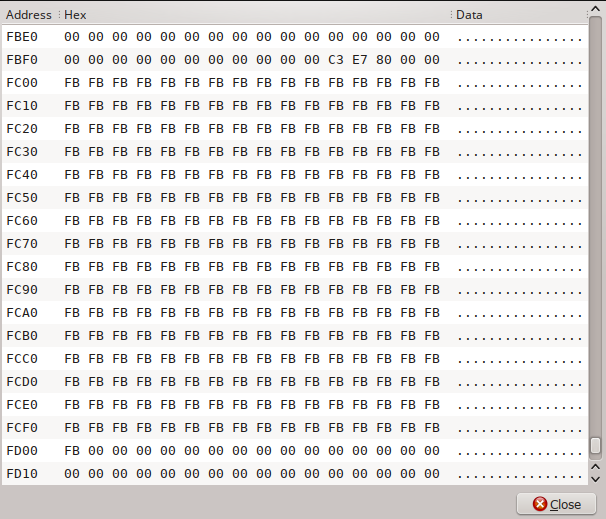

# ZX Spectrum Development with Z88DK - Interrupts

This is the eighth document in the series which describes how to get started
writing ZX Spectrum programs using Z88DK. As before, it concerns itself only
with the newer, more standards compliant zsdcc C compiler. Neither the original
sccz80 compiler nor the classic library is discussed.

This document relates specifically to the 48K Spectrum. Other models have more
complex memory management and are not covered here.

## Assumptions

It is assumed the reader has worked through the earlier installments of this
series and is continuing on from [installment 7](https://github.com/z88dk/z88dk/blob/master/doc/ZXSpectrumZSDCCnewlib_07_BiFrost.md).

If you would like to jump to the beginning, click on [installment 1](https://github.com/z88dk/z88dk/blob/master/doc/ZXSpectrumZSDCCnewlib_01_GettingStarted.md).

Two documents are referenced in the introduction below: the generic interrupts
document in the Z88DK wiki, and the Coders Bucket blog post which covers
Spectrum interrupts more specifically. The reader is assumed to have read and
understood these documents. Concepts covered in them, such as the "vector
table," will not be described again here.

## Z88DK and the Spectrum's Interrupt Mode 2

Z88DK's support for Z80 interrupt handling is comprehensive and is already
described in detail in this [generic Z80 interrupts
document](https://www.z88dk.org/wiki/doku.php?id=library:interrupts) in the
Z88DK wiki. If the reader hasn't read that document, now is the time to do
so. The Spectrum's use of the Z80 interrupt is described rather well in this
[blog post](http://codersbucket.blogspot.co.uk/2015/04/interrupts-on-zx-spectrum-what-are.html),
albeit from a machine code perspective. This guide will build on those.

The Spectrum normally (i.e. when it's running BASIC) runs with the Z80 CPU in
interrupt mode 1. Mode 2 is the more flexible and powerful one, so we're going
to take a look at using interrupt mode 2 ("IM 2") on the 48K Spectrum from C
using Z88DK.

There are two key details which the reader needs to understand having read the
generic Z80 wiki document. The first is the use of the term "interrupting
peripheral" in the context of IM 2 on the ZX Spectrum. On the Spectrum, the
interrupting peripheral is the video circuitry. The Spectrum constantly
generates the interrupt signal in sync with the TV picture it's generating, and
it does so 50 times a second. This 50Hz signal is the Spectrum's interrupt, and
it's this which we'll be using from Z88DK.

The second key detail the reader needs to understand is concept of the
[interrupt mode 2](https://www.z88dk.org/wiki/doku.php?id=library:interrupts#im_2) "identifier
byte supplied by the interrupting peripheral". On the Spectrum the interrupting
peripheral, the video hardware, doesn't supply this identifier byte. It
essentially arrives as a random number from 0-255, and this is the reason Spectrum
programs need to build a specifically configured vector table when using
interrupt mode 2. This is hinted at in the [second
example](https://www.z88dk.org/wiki/doku.php?id=library:interrupts#code_example_2)
in the wiki document which refers to "some im2-unaware devices" which don't
provide an identifier byte. That's referring to the Spectrum, amongst
others. We'll see how to handle this from C using Z88DK.

### A Non-simple Example

Unusually for this series, the example which follows isn't a particularly simple
one. The Z88DK wiki document already referenced provides a simple example to get
started with. What follows is a careful examination of how an IM 2 example can
be fitted into the Spectrum's memory model. If we're going to write complex
programs which use interrupts we need to think things through carefully. Just
throwing things into RAM at any location might work in the short term, but in
the longer term will result in baffling crashes when memory gets
overwritten. Let's take this slowly.

The steps required to set up a Spectrum IM 2 routine are these:

* fill in the vector table with a complete set of vectors, all the same
* at that vector, place an instruction to jump to the interrupt service routine
* set the Z80's I register to point at the vector table
* enable the interrupts

The first issue we need to cover is, where can we put the vector table and jump
instruction? The answer is, anywhere convenient, but that doesn't really answer
the question properly. What follows is a description of one solution which would
work for a program where such things can be placed out of the way in high
memory. As befits a getting started guide, this configuration will suit many
scenarios and will suffice until the reader is knowledgeable enough to work out
a more suitable alternative for their situation.

Our vector table needs to be 257 bytes. Referring back to [installment
6](https://github.com/derekfountain/z88dk/blob/master/doc/ZXSpectrumZSDCCnewlib_06_SomeDetails.md)
of this getting started guide where we looked at the memory map of the Spectrum,
we see that with the default compiler settings our simple program's memory map
looks like this:


```
+-------------+
|0xFFFF  65535|
|             | User Defined Graphics
|0xFF58  65368| <-- SP
|-------------|
|0xFF58  65367| Z88DK program's stack
| (512 bytes) | Grows downwards, remember!
|0xFD57  64855|
|-------------|
|0xFD56  64854|
|             |
|             | Z88DK heap memory
|             |
|             |
|-------------|
|             | Z88DK BSS section  (CRT_ORG_BSS)
|             | Z88DK DATA section (CRT_ORG_DATA)
|-------------| ^^^
|             |
|0x8000  32768| Z88DK compiled C   (CRT_ORG_CODE)
|-------------|
|             | Lower RAM, includes basic program,
|             | sys vars, print buffer, etc.
|             | Slower, "contended memory"
|-------------|
|0x5AFF  23295|
|             | Display File (i.e. screen memory)
|0x4000  16384|
|-------------|
|0x3FFF  16383|
|             | ROM
|0x0000      0|
+-------------+
```

We need to find somewhere in there where 257 bytes won't cause a problem, and
that 257 byte block needs to be on a 256 byte boundary because we only get to
specify the high byte of its address. We can't put it in the ROM or screen
areas, and we can't put it somewhere where the stack or heap are likely to grow
into because it will be corrupted. So where's good?

By default the stack starts at address 0xFF58, as shown in the illustration
above. We can move it if we want to, but that's a sensible place if we're to
preserve the UDGs. So let's leave it there. The highest memory location we can
place our 257 byte vector table below the stack is therefore 0xFE00-0xFF00
inclusive, but that would only give the stack 87 bytes (0x57 hex) bytes to grow
down into. That would be too tight for all but the simplest program, so let's
put the vector table 512 bytes lower, occupying memory locations 0xFC00-FD00
inclusive. That will give our stack 600 bytes to grow down into:

```
|-------------|
|0xFF58  65368| Z88DK program's stack
|             | (600 bytes total)
|0xFD01  64769|
|-------------|
|0xFD00  64768| IM 2 vector table
|             | (257 bytes total)
|0xFC00  64512|
|-------------|
|             |
|             |
|             | Z88DK heap memory
|             |
|             |
|-------------|
|             | Z88DK BSS section  (CRT_ORG_BSS)
|             | Z88DK DATA section (CRT_ORG_DATA)
|-------------| ^^^
```

This vector table needs to be filled with 257 bytes, all the same. They make up
an address of a jump instruction. Because the high and low bytes must be the
same we're restricted in the vector address we can use. Again, anywhere suitable
will do the job, but we keep to our plan of putting things as high up in memory
as possible. 0xFFFF is the top of memory, so that's no good. 0xFEFE and 0xFDFD
are the next ones down, but those are in the stack area. Next would be 0xFCFC
which is in our vector table so that's no use either. Next one down is
0xFBFB. Ah, this looks better. That's just below the vector table. We need 3
bytes for our JMP instruction, so we can use the bytes at 0xFBFB, 0xFBFC and
0xFBFD:

```
|-------------|
|0xFF58  65368| Z88DK program's stack
|             | (600 bytes total)
|0xFD01  64769|
|-------------|
|0xFD00  64768| IM 2 vector table
|             | (257 bytes total)
|0xFC00  64512|
|-------------|
|0xFBFF       | 2 unused bytes
|0xFBFE       |
|-------------|
|0xFBFD       | IM 2 JMP instruction
|0xFBFC       | (3 bytes total)
|0xFBFB       |
|-------------|
|             |
|             |
|             | Z88DK heap memory
|             |
|             |
|-------------|
|             | Z88DK BSS section  (CRT_ORG_BSS)
|             | Z88DK DATA section (CRT_ORG_DATA)
|-------------| ^^^
```

So our situation now is that the Z88DK program, with its DATA and BSS sections
and heap, start (by default) at 0x8000 (32768) and grow upwards. The top byte of
the heap will be 0xFBFA, above which is our JMP instruction, then 2 unused
bytes, then the vector table, then the 600 byte stack, then the UDGs. This is a
reasonably compact and memory efficient arrangement, but as mentioned before,
it's only one solution. If your program already has something in high memory
you'll need to rearrange things. For now, this approach works for us.

Having worked all that out, we can now look at the program which arranges it.

### Example Code

Here's a piece of code which sets up interrupt mode 2 routine as per the
discussion above:

```
#pragma output REGISTER_SP = 0xFF58
#pragma output CLIB_MALLOC_HEAP_SIZE = -0xFBFA

#include <z80.h>
#include <string.h>
#include <intrinsic.h>
#include <im2.h>
#include <arch/zx.h>

IM2_DEFINE_ISR(isr)
{
  *(unsigned char*)0x4000 = 0x55;
}

#define TABLE_HIGH_BYTE        ((unsigned int)0xfc)
#define JUMP_POINT_HIGH_BYTE   ((unsigned int)0xfb)

#define UI_256                 ((unsigned int)256)

#define TABLE_ADDR             ((void*)(TABLE_HIGH_BYTE*UI_256))
#define JUMP_POINT             ((unsigned char*)( (unsigned int)(JUMP_POINT_HIGH_BYTE*UI_256) + JUMP_POINT_HIGH_BYTE ))

int main()
{
  memset( TABLE_ADDR, JUMP_POINT_HIGH_BYTE, 257 );

  z80_bpoke( JUMP_POINT,   195 );
  z80_wpoke( JUMP_POINT+1, (unsigned int)isr );

  im2_init( TABLE_ADDR );

  intrinsic_ei();

  while(1);
}
```

Save this to a file called im2_simple.c and compile it with this command:

```
zcc +zx -vn -clib=sdcc_iy -startup=31 im2_simple.c -o im2_simple -create-app
```

This is our typical, simplest compile command, using the stripped down CRT31. It
deliberately uses C macros to define the salient values to make things a bit
clearer. If you run it you'll notice that a) a small dashed line appears in the
top left corner of the screen and b) the Spectrum locks up.  Let's look at the
code to see what's happening.

The first pragma, as we saw in [installment 6](https://github.com/z88dk/z88dk/blob/master/doc/ZXSpectrumZSDCCnewlib_06_SomeDetails.md#changing-the-memory-layout),
sets the stack pointer to address 0xFF58. This happens to be the default stack
location but there's no harm is stating it explicitly. The second pragma sets
the top byte of the heap to address 0xFBFA. Note how this is done: you give it
the negation of the absolute address you want the top byte of the heap to be, as described
[here](https://www.z88dk.org/wiki/doku.php?id=libnew:target_embedded&s[]=crt&s[]=enable&s[]=restart#crt_configuration).
If the program attempts a *malloc()* which would cause the heap to overwrite the
interrupt structures, the *malloc()* will fail.

The first thing the code does in *main()* is set up the vector table. As described
above, the table will occupy the 257 bytes from 0xFC00, so a simple *memset()* is
all that's required. The jump vector is at 0xFBFB, so the table is filled with
0xFB in every byte.

Next we need to place our redirection JMP instruction at address 0xFBFB. This is
simply :

```
  JMP isr
```

where *'isr'* is the address of our C routine. This jump point is placed in memory
with the Z88DK *z80*_*poke()* calls. The first puts in the value 195 (that's 0xC3 hex),
which is the Z80 machine code value for the JMP instruction. The second puts in
the address of the interrupt service routine named *isr()*, and which will be
located somewhere in memory by the compiler. We can use its symbol in the C
code.

We can see this arrangement in memory using an emulator's memory inspector:



This screenshot is from Fuse which displays memory upside down. You can see the
JMP instruction in the "C3 E7 80" bytes at 0xFBFB (so for this compilation the
*isr()* routine was placed at 0x80E7).  Then there are 2 empty bytes, then the
vector table, full of 0xFB bytes.

The definition of the interrupt service routine *isr()* uses a wrapper macro
*IM2_DEFINE_ISR()*. This is because a C function can't be used as an interrupt
service routine by itself. It needs some Z80 instructions around it which save a
few registers on the stack, restore them when the routine is finished, plus some
other housekeeping bit and pieces. The details aren't really important here; all
that's required is that the definition of the C function to be used as the interrupt
service routine is wrapped in the *IM2_DEFINE_ISR()* macro. The C compiler
looks after everything else.

In this example the interrupt service routine simply places the value 0x55 in
the first byte of screen memory, hence the small dashed line in the Spectrum's
display when this code is run.

Back in the *main()* function, after the pokes to place the JMP instruction we
have the call to *im2_init()*. This library function takes the address of the
vector table which it programs into the Z80's I register, and then sets
the interrupt mode to 2. We then enable interrupts and the interrupt service
routine will start being called every 50th of a second.

### Returning to BASIC with IM 2 still set

In the example above we end by going into an infinite loop, which is why the
Spectrum locks up with this program. The reason for this is that by default a
Z88DK Spectrum program resets the interrupt mode to 1 when it exits and returns
to BASIC. For this example we don't want this to happen, otherwise we wouldn't
see the dashed line in the display.

We can control the interrupt mode the program exits with via the
*CRT_INTERRUPT_MODE_EXIT* pragma, like this:

```
#pragma output CRT_INTERRUPT_MODE_EXIT = 2
```

Placing this line at the top of the program ensures the compiler generates code
which leaves interrupt mode 2 active when the program exits. Thus the C code
interrupt service routine will continue running when control is returned to
BASIC.

To use this feature we need to ensure that as well as having our C interrupt
service routine run every interrupt, we must also have the Spectrum's BASIC
interrupt service routine called as well. This is because that code, in the
Spectrum's ROM, handles things like keyboard input which BASIC expects to keep
happening. We arrange this by wrapping our interrupt service routine definition
with the *IM2_DEFINE_ISR_WITH_BASIC()* macro. This adds the same housekeeping
wrapping code around the C ISR, and additionally makes a call into the Spectrum's
ROM to run the BASIC ISR as well. If you're interested, you can see how this is
set up by looking at the macro in the [im2 header file](https://github.com/z88dk/z88dk/blob/master/include/_DEVELOPMENT/sdcc/im2.h#L87).

With this in place we can set up a C code interrupt service routine, then return
to BASIC with it still running, like this example:

```

#pragma output REGISTER_SP = 0xFF58
#pragma output CLIB_MALLOC_HEAP_SIZE = -0xFBFA

/* Ensure IM2 is left at exit */
#pragma output CRT_INTERRUPT_MODE_EXIT = 2

#include <z80.h>
#include <string.h>
#include <im2.h>
#include <arch/zx.h>


static unsigned char  ticker_string[] = "Hello, world! ";
static unsigned char* current_char_ptr;

/* Address in ROM of the character being scrolled into view */
static unsigned char* rom_address;

/* Bit, left to right, of the character to scroll into view next. Goes 128, 64, 32...1 */
static unsigned char  bit;

/*
 * Off-screen buffer to put the display into. This is blitted into the screen, replacing
 * whatever the user's program happens to have put there. A "merge" would be friendlier. :)
 */
static unsigned char  off_screen_buffer[32*8];

IM2_DEFINE_ISR_WITH_BASIC(isr)
{
  unsigned char* buffer_address;
  unsigned char  i;

  /*
   * Scroll off-screen display buffer data leftwards one byte. This is just a memory move downwards by one. 
   */
  memcpy((unsigned char*)off_screen_buffer, (unsigned char*)off_screen_buffer+1, sizeof(off_screen_buffer)-1);

  /*
   * For each of the 8 lines (top to bottom) of the character we're displaying, pick out
   * the current bit (left to right). If it's a 1, set the rightmost attribute cell to
   * colour, otherwise set the attribute cell white. This is done in the off-screen buffer.
   */
  buffer_address = (unsigned char*)&off_screen_buffer+0x1f;
  for( i=0; i<8; i++ )
  {
    unsigned char attribute_value;

    attribute_value = ( *rom_address & bit ) ? PAPER_MAGENTA : PAPER_WHITE;

    *buffer_address = attribute_value;
    buffer_address += 0x20;

    rom_address++;
  }

  /*
   * If that was the rightmost bit of the character, that character's done with. Move to the
   * next character in the display string and start again at its left side (bit 128).
   * Otherwise keep with the same character and get ready for the next bit.
   */
  if( bit == 1 )
  {
    current_char_ptr++;
    if( *current_char_ptr == '\0' )
      current_char_ptr = ticker_string;

    rom_address = ((*current_char_ptr-0x20)*8)+(unsigned char*)0x3D00;

    bit = 128;
  }
  else
  {
    bit = bit/2;

    /* Still on the same character, so move back to the start of its data in ROM */
    rom_address -= 8;
  }

  /* Copy the off-screen buffer into the display */
  memcpy( (unsigned char*)0x5800, off_screen_buffer, sizeof(off_screen_buffer) );
}


#define TABLE_HIGH_BYTE        ((unsigned int)0xfc)
#define JUMP_POINT_HIGH_BYTE   ((unsigned int)0xfb)

#define UI_256                 ((unsigned int)256)

#define TABLE_ADDR             ((void*)(TABLE_HIGH_BYTE*UI_256))
#define JUMP_POINT             ((unsigned char*)( (unsigned int)(JUMP_POINT_HIGH_BYTE*UI_256) + JUMP_POINT_HIGH_BYTE ))

int main()
{
  /*
   * Initialise the ticker and its buffer
   */
  memset( off_screen_buffer, PAPER_WHITE+INK_WHITE, sizeof(off_screen_buffer) );

  current_char_ptr = ticker_string;
  rom_address      = ((*current_char_ptr-0x20)*8)+(unsigned char*)0x3D00;
  bit              = 128;

  /* Set up the interrupt vector table */
  im2_init( TABLE_ADDR );

  memset( TABLE_ADDR, JUMP_POINT_HIGH_BYTE, 257 );

  z80_bpoke( JUMP_POINT,   195 );
  z80_wpoke( JUMP_POINT+1, (unsigned int)isr );

  return 0;
}
```

Compile this with:

```
zcc +zx -vn -clib=sdcc_iy -startup=31 atts_ticker.c -o atts_ticker -create-app
```

Note how the call to *intrinsic_ei()* isn't required in the *main()* code in this
example. This is because the Z88DK CRT code will always contain an instruction
to re-enable interrupts when returning to BASIC.

### Warnings

Working with interrupts on the Spectrum can be a fiddly business, and it's an
area where intimate knowledge of the hardware is required to ensure correct and
reliable operation. For example, the programmer needs to beware of putting the
interrupt structures in lower, contended memory. Issues with the Spectrum
hardware make this produce an on-screen effect colloquially known as
"snow".

Also, although this getting started series only applies to the 48K Spectrum, it
should be pointed out that arranging things in high memory on the 128K machines
can cause problems with bank switching. Crashes caused by the interrupt
structures suddenly disappearing or being overwritten can be baffling, which is
why this guide has focused so heavily on understanding the memory layout.

If you find yourself uncertain as to how to proceed with a particular scenario,
or are getting occasional or strange, sudden crashes, consider raising the
issue on the Z88DK [ZX support forum](https://www.z88dk.org/forum/viewforum.php?id=2).

### Conclusion

There's more to look at regarding the programming of the Spectrum's interrupts
with Z88DK, but it's all well documented so doesn't need to be explored further
here. This guide has built on the existing documentation by looking at the some
of the options for laying out the Spectrum's memory map when using interrupt mode
2. Understanding the memory map is a skill we need to continue to develop.
