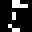

# ZX Spectrum Development with C, Z88DK and SP1 - Animated Sprite

This document describes how a ZX Spectrum developer can use the SP1 sprite
library to animate a sprite on screen. It follows on from the [second
document](https://github.com/z88dk/z88dk/blob/master/doc/ZXSpectrumZSDCCnewlib_SP1_02_SimpleMaskedSprite.md)
in the series, which the reader is assumed to have read.

This document is part of the [ZX Spectrum Z88DK/C developer's getting
started guide](https://github.com/z88dk/z88dk/blob/master/doc/ZXSpectrumZSDCCnewlib_GettingStartedGuide.md).

## Purpose

So far in this SP1 series we've looked at displaying simple and masked
sprites on the SP1-controlled display. When working through both of
those examples we've only looked at single frame, non-animated
sprites. In this document we look at multiple frame sprites and their
animation.

There are two approaches to using the SP1 library to display a sprite
and so far we've only looked at one of them. Here, we introduce the
second approach.

### The Sprite Data

For this article we're going stay with the same sort of 8x8 pixel, single column
sprites we've used so far in the series. The animated sprite we're going to use
is a little "runner" character kindly supplied by
[Sol_HSA](https://www.worldofspectrum.org/forums/profile/10193/Sol_HSA) over at
World of Spectrum. Here it is as an animated GIF file:



The sprite has 8 "frames" of animation. As in previous examples, we
code this graphics data as an assembly listing:

```
SECTION rodata_user

PUBLIC _runner_f1

	defb @00000000
	defb @00000000
	defb @00000000
	defb @00000000
	defb @00000000
	defb @00000000
	defb @00000000

._runner_f1
	defb @00011000
	defb @00011110
	defb @00000000
	defb @00010000
	defb @00010000
	defb @00000000
	defb @00100000
	defb @00011000

	defb @00000000
	defb @00000000
	defb @00000000
	defb @00000000
	defb @00000000
	defb @00000000
	defb @00000000
	defb @00000000
	
._runner_f2
	defb @00011000
	defb @00011110
	defb @00000000
	defb @00100000
	defb @00100000
	defb @00000010
	defb @00000100
	defb @00110000

	defb @00000000
	defb @00000000
	defb @00000000
	defb @00000000
	defb @00000000
	defb @00000000
	defb @00000000
	defb @00000000
	
._runner_f3
	defb @00000000
	defb @00011000
	defb @00011110
	defb @00000000
	defb @00100000
	defb @01000000
	defb @00000000
	defb @01100110

	defb @00000000
	defb @00000000
	defb @00000000
	defb @00000000
	defb @00000000
	defb @00000000
	defb @00000000
	defb @00000000
	
._runner_f4
	defb @00011000
	defb @00011110
	defb @00000000
	defb @00010000
	defb @00100000
	defb @00000000
	defb @01000000
	defb @01001100

	defb @00000000
	defb @00000000
	defb @00000000
	defb @00000000
	defb @00000000
	defb @00000000
	defb @00000000
	defb @00000000
	
._runner_f5
	defb @00011000
	defb @00011110
	defb @00000000
	defb @00001000
	defb @00010000
	defb @00000000
	defb @00100000
	defb @00011000

	defb @00000000
	defb @00000000
	defb @00000000
	defb @00000000
	defb @00000000
	defb @00000000
	defb @00000000
	defb @00000000
		
._runner_f6
	defb @00011000
	defb @00011110
	defb @00000000
	defb @00001000
	defb @00001000
	defb @00000010
	defb @00000100
	defb @00110000

	defb @00000000
	defb @00000000
	defb @00000000
	defb @00000000
	defb @00000000
	defb @00000000
	defb @00000000
	defb @00000000
		
._runner_f7
	defb @00000000
	defb @00011000
	defb @00011110
	defb @00000000
	defb @00001000
	defb @00000100
	defb @00000000
	defb @01100110

	defb @00000000
	defb @00000000
	defb @00000000
	defb @00000000
	defb @00000000
	defb @00000000
	defb @00000000
	defb @00000000
		
._runner_f8
	defb @00011000
	defb @00011110
	defb @00000000
	defb @00010000
	defb @00001000
	defb @00000000
	defb @01000000
	defb @01001100

	defb @00000000
	defb @00000000
	defb @00000000
	defb @00000000
	defb @00000000
	defb @00000000
	defb @00000000
	defb @00000000
```

The first thing to note about this data is that it was typed in by your author,
by hand. The animated GIF was loaded into a graphics editor where the frames
were examined and the binary data carefully copied, bit by bit, into the
listing above. As of this writing there doesn't appear to be any magic tool to
create SP1 sprite data assembly listings from an animated GIF.

Secondly, there is no mask data in this listing, for no reason other than your
author didn't want to have to type those data lines in as well. We're going to
go back to using SP1's LOAD draw routines which we used in [article
1](https://github.com/z88dk/z88dk/blob/master/doc/ZXSpectrumZSDCCnewlib_SP1_01_GettingStarted.md#a-closer-look-at-the-sprites-code).

What we have here is the data for an 8 frame sprite. That is, 8
separate 8x8 pixel graphics, which drawn in sequence create the
animation. Frame 8 is designed to loop back to frame 1, and each frame
is designed to move the character one pixel left to right to produce a
walking effect one pixel at a time.

The individual frames are labelled in the listing, but only for information
purposes. These labels are not exported since the C code doesn't need them for
this example. We only export the first frame address.

Notice how each frame is separated from the next with 8 zero bytes. As discussed
in the [first
article](https://github.com/z88dk/z88dk/blob/master/doc/ZXSpectrumZSDCCnewlib_SP1_01_GettingStarted.md#pixel-positioning)
in this series, each sprite needs to have 7 zero bytes *before* it in memory,
and also 8 zero bytes *after* it, in order to facilitate precise pixel
positioning. This requirement persists for individual sprite animation frames,
and when sprite frames are positioned sequentially in memory, as they are here,
it's convenient to use the same 8 zero bytes as the *after* bytes for one frame
and the *before* bytes for the following frame. This technique saves some memory.

Finally, take note that given this layout each frame is located 16 bytes higher
in memory than the previous one. For example, label *runner_f2* will assemble to
be 16 greater than label *runner_f1*, those being the 8 bytes of data for frame
1, plus the 8 bytes of zeros which separate frame 1 from frame 2. This is
important because this value of *16 bytes* becomes a sort of *magic number* when
we get to the code in a moment.

Save this listing to a file called *runner_sprite.asm*.

## Animating the sprite

In order to animate the sprite it needs to be displayed on a frame by frame
basis. When the next frame should be shown depends of the design of the
program. The simple approach, which we can use with this sprite, is to advance to
the next frame each time the sprite moves on screen. Our character runs from
left to right, so we can move to the next frame each time he moves one pixel.

An alternative approach might be to advance to the next frame each time a timer
expires. This has the advantage that the sprite can be animated event when it's
stationary, but it doesn't really work for our *runner* character. Another
approach is to react to the user's input, which might be made to work with our
*runner* as long as the user only ever presses the *right* key. :)

For demonstration, we'll keep it simple and animate our sprite walking left to
right across the screen.

The SP1 library provides two ways to draw sprites on the screen using
SP1, and now, as we're discussing animation, is the time to introduce
the two different approaches.

### Sequential animation

In previous example code in this series we've built and drawn sprites using the
following combination of SP1 library calls:

Firstly, we create the sprite structure in memory, passing the graphic data (at
address *runner_f1* in the example we're building) into the sprite creation
library function:

```
sprite = sp1_CreateSpr(SP1_DRAW_LOAD1LB, SP1_TYPE_1BYTE, 2, (int)runner_f1, 0);
```

Later in the program we place that sprite on screen using one of the sprite
movement functions:

```
sp1_MoveSprPix(sprite, &full_screen, 0, x, y);
```

So far we've studiously ignored that 3rd argument to the movement function (the
zero in the above line). That value is the key to one approach to animation in
SP1; its purpose is to provide an offset value into the graphic data, that
offset indicating which sprite frame we want drawn at the next screen
refresh. So for our runner sprite we would start with an offset of 0, indicating
we want the 1st frame (which is at address *runner_f1* as provided to the
sp1_CreateSpr() call). For the next frame we'd want an offset of 16, which is
the difference from address *runner_f1* to address *runner_f2*. Recall the
*magic number* we discussed earlier? This is what it's for: it's the offset
number of bytes from one frame in our animated sprite to the next. Each time we
call the sprite movement routine we bump the offset by 16 bytes, until we've
displayed the final frame, at which point we go back to an offset of 0 to make
the animation loop round.

Only, there's a complication. Due to what might be termed a quirk in the SP1
interface, it's easier to set the offset value in the sprite structure directly
than it is to use that third argument of the sprite movement call (which we
leave at zero). So our code will actually do this:

```
sprite->frame = (void*)animation_offset;
sp1_MoveSprPix(sprite, &full_screen, 0, x, y);
```

which does exactly what the SP1 interface was supposed to do, only avoiding the
quirk. (This is one of those moments where it's better for an SP1 beginner to
not worry about the detail too much and just do as advised. The underlying issue
is discussed in [this forum
thread](https://www.z88dk.org/forum/viewtopic.php?id=10277)
if you're interested, and you can always come back to it when you understand more.)

With this animation code in place, here's the program to walk our character
across the screen. Save it to a file called 'runner.c':

```
#pragma output REGISTER_SP = 0xD000

#include <arch/zx.h>
#include <z80.h>
#include <arch/zx/sp1.h>

extern unsigned char runner_f1[];

struct sp1_Rect full_screen = {0, 0, 32, 24};

int main()
{
  struct sp1_ss  *runner_sprite;
  unsigned char   x;
  unsigned char   animation_offset;

  zx_border(INK_BLACK);

  sp1_Initialize( SP1_IFLAG_MAKE_ROTTBL | SP1_IFLAG_OVERWRITE_TILES | SP1_IFLAG_OVERWRITE_DFILE,
                  INK_BLACK | PAPER_WHITE,
                  ' ' );
  sp1_Invalidate(&full_screen);
 
  runner_sprite = sp1_CreateSpr(SP1_DRAW_LOAD1LB, SP1_TYPE_1BYTE, 2, (int)runner_f1, 0);

  sp1_AddColSpr(runner_sprite, SP1_DRAW_LOAD1RB, SP1_TYPE_1BYTE, 0, 0);

  x=0;
  animation_offset=0;
  while(1) {
    runner_sprite->frame = (void*)animation_offset;
    sp1_MoveSprPix(runner_sprite, &full_screen, 0, x++, 80);

    animation_offset+=16;
    if( animation_offset == 128 )
    {
      animation_offset = 0;
    }

    z80_delay_ms(50);
    sp1_UpdateNow();
  }
}
```

The compile line is:

```
zcc +zx -vn -startup=31 -clib=sdcc_iy runner.c runner_sprite.asm -o runner -create-app
```

The main loop starts with an animation offset of 0, so we start with the first
frame. We increment the offset each time around the loop, resetting after the
8th frame of our animation so we go back to the beginning. Rather than using the
interrupt to *HALT* the Z80 in order to slow the animation, this example (which
doesn't enable interrupts) adds a pause to slow things down.

### State based animation

Sequential animation works well for sprites like the runner character
where the frames follow on from each other in a loop, but many sprites
don't work like that. It's common for a video game character to be in one
of many states, and to transition between those states based on
external stimuli. For example, a character might transition from left,
to right, to climbing, to crouching, to dead, all on user key presses
and other game events. This sort of thing is typically done with a
state machine, and each state transition needs an update to the sprite
graphic.

The sequential graphical frame approach we've seen, where we calculate
offsets to the appropriate frame data, doesn't really work for this
sort of animation. It's simpler to just store the absolute address of
the graphical data for each state, and switch to using that data when
the sprite moves to the state. This is the nature of the second
approach the SP1 library uses for sprite animation.

Let's look at a trivial example to see how the code changes. Save this
code to a file called *arrow_sprite.asm*:

```
SECTION rodata_user

PUBLIC _arrow_left
PUBLIC _arrow_right

	defb @00000000
	defb @00000000
	defb @00000000
	defb @00000000
	defb @00000000
	defb @00000000
	defb @00000000

._arrow_left
	defb @00010000
	defb @00100000
	defb @01011111
	defb @10000001
	defb @10000001
	defb @01011111
	defb @00100000
	defb @00010000

	defb @00000000
	defb @00000000
	defb @00000000
	defb @00000000
	defb @00000000
	defb @00000000
	defb @00000000
	defb @00000000
	
._arrow_right
	defb @00001000
	defb @00000100
	defb @11111010
	defb @10000001
	defb @10000001
	defb @11111010
	defb @00000100
	defb @00001000

	defb @00000000
	defb @00000000
	defb @00000000
	defb @00000000
	defb @00000000
	defb @00000000
	defb @00000000
	defb @00000000	
```

This is a simple 2-state sprite representing an arrow. One state has
it facing left, the other has it facing right. The addresses of both
frames are exported to the C.

Here's the C code, which you should save to a file called
*arrow_sprite.c*:

```

#pragma output REGISTER_SP = 0xD000

#include <arch/zx.h>
#include <z80.h>
#include <arch/zx/sp1.h>
#include <input.h>

extern unsigned char arrow_left[];
extern unsigned char arrow_right[];

struct sp1_Rect full_screen = {0, 0, 32, 24};

struct
{
  unsigned int   scan_code;
  unsigned char *graphic;
  signed   char  x_delta;
}
arrow_state[] = { {IN_KEY_SCANCODE_o, arrow_left,  -1},
                  {IN_KEY_SCANCODE_p, arrow_right, +1} };

int main()
{
  struct sp1_ss  *arrow_sprite;

  unsigned char   x     = 128;
  unsigned char   state = 0;

  zx_border(INK_BLACK);

  sp1_Initialize( SP1_IFLAG_MAKE_ROTTBL | SP1_IFLAG_OVERWRITE_TILES | SP1_IFLAG_OVERWRITE_DFILE,
                  INK_BLACK | PAPER_WHITE,
                  ' ' );
  sp1_Invalidate(&full_screen);
 
  arrow_sprite = sp1_CreateSpr(SP1_DRAW_LOAD1LB, SP1_TYPE_1BYTE, 2, 0, 0);
  sp1_AddColSpr(arrow_sprite, SP1_DRAW_LOAD1RB, SP1_TYPE_1BYTE, 0, 0);

  while( 1 ) {
    unsigned char i;

    for( i=0; i<2; i++ )
    {
      if( in_key_pressed( arrow_state[i].scan_code ) == 0xFFFF ) {
        state = i;
        break;
      }
    }

    x += arrow_state[state].x_delta;

    sp1_MoveSprPix(arrow_sprite, &full_screen, arrow_state[state].graphic, x, 80);
    z80_delay_ms(10);

    sp1_UpdateNow();    
  }
}
```

Compile this example with:

```
zcc +zx -vn -m -startup=31 -clib=sdcc_iy arrow_sprite.c arrow_sprite.asm -o arrow_sprite -create-app
```

The main difference to the sprite handling introduced here is that the
sprite creation function, *sp1_CreateSpr()*, has a null value in its
penultimate argument. We're not giving the graphical data address
here. Instead we provide the graphic data address to the
*sp1_MoveSprPix()* function in the third argument - it's not an offset
here, we're effectively saying "move the sprite to this screen
location, and show it using this graphical data."

The rest of the code should be simple to understand. We create a
structure which holds a [key
scancode](https://github.com/z88dk/z88dk/blob/master/doc/ZXSpectrumZSDCCnewlib_04_InputDevices.md#scancodes)
which will allow us to detect
user input and hence change state on cue, the graphical data to use
when in the state, and a value to adjust the sprite's screen position
by each time round the game loop while in the state. In this simple
example we only have two such states for the sprite, moving left and
moving right, so we have an array of 2 of these structures.

The "game loop" therefore iterates over the array testing for the key
scancode for each state. If the relevant key is pressed we adopt that
state. From there we update the sprite's screen coordinates according
to the delta in the state information, and move and display the sprite
with the appropriate graphical data.

Of course, this is a trivial example. A real game, where the
characters walk, run, jump, climb, shoot and die might need dozens of
sprite frames, all linked via state machines which smoothly transition
from one state to the next.

## Exercises for the reader

* Add [mask data](https://github.com/z88dk/z88dk/blob/master/doc/ZXSpectrumZSDCCnewlib_SP1_02_SimpleMaskedSprite.md#the-sprite-data)
to the runner sprite and have him run through a screen with a background.

* Add more states and graphics to the arrow sprite example. Change it
so you can guide the arrow using Q, A, O and P.

* Add an explosion state, which the arrow takes if you let it hit the
side of the screen.

## Conclusion

We've now looked at both approaches to drawing sprites with SP1, in
particular in the context of animation. One uses a data address
together with a varying offset to locate a specific frame, and the
other uses absolute frame addresses each time the sprite needs to be
moved. While both approaches have their merits and use cases, it's
the second approach which is generally more popular. Certainly, most
of the SP1 example code in Z88DK uses it.

The [next article](https://github.com/z88dk/z88dk/blob/master/doc/ZXSpectrumZSDCCnewlib_SP1_04_BiggerSprites.md)
in this series looks at creating bigger and more colourful sprites.