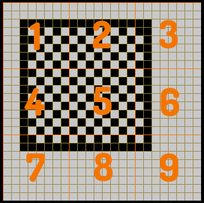
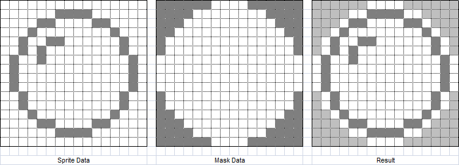

# ZX Spectrum Development with C, Z88DK and SP1 - Bigger, Colourful Sprites

This document, the 4th in the SP1 part of the [ZX Spectrum Z88DK/C developer's
getting started guide](https://github.com/z88dk/z88dk/blob/master/doc/ZXSpectrumZSDCCnewlib_GettingStartedGuide.md),
builds on the previous 3 instalments, showing how to create bigger and more
colourful sprites. It follows on from the [third
document](https://github.com/z88dk/z88dk/blob/master/doc/ZXSpectrumZSDCCnewlib_SP1_03_AnimatedSprite.md)
which looked at animation.

## Purpose

So far in this SP1 series we've only looked at small, single character cell,
monochrome sprites. While simple to explore and understand, 8x8 pixel sprites
are of limited use for games. We need to look at how SP1 handles bigger sprites.

While we're wrapping up this initial guide to working with SP1 sprites we'll also
have a look at applying some colour to them as well.

## 16x16 Pixel Sprite

The 16x16 pixel sprite is the mainstay of Spectrum graphics. It's big enough to
be nicely visible, but still small enough that the hardware can handle it.

As far as SP1 is concerned a 16x16 pixel sprite is made up of 2 columns, each 8
pixels wide and 16 pixels high. If aligned on 8 pixel boundaries the sprite will
occupy 4 character cells. If it's shifted horizontally by between 1 and 7 pixels
it'll occupy 2 more character cells in the horizontal plane, making a total of
6. If it's also shifted vertically by between 1 and 7 pixels it'll occupy 9
character cells, as shown in this image:



All of this detail is handled by SP1. All we have to do is create the sprite
much like we have been doing, and add the extra column being sure to tell SP1
the correct maximum height of the sprite in character cells.

### 16x16 Example

We're going to work through an example with a 16x16 pixel masked sprite kindly
provided by Dean Belfield at [Break Into Program](http://www.breakintoprogram.co.uk/):



We need to convert this graphical data and the mask into an SP1 sprite data
structure. Here it is in assembly language, which you should save to a file
called *bubble_masked_sprite.asm*:

```
SECTION rodata_user

PUBLIC _bubble_col1
PUBLIC _bubble_col2
	
	defb @11111111, @00000000
	defb @11111111, @00000000
	defb @11111111, @00000000
	defb @11111111, @00000000
	defb @11111111, @00000000
	defb @11111111, @00000000
	defb @11111111, @00000000

._bubble_col1
	defb @11111100, @00000000
	defb @11110000, @00000011
	defb @11100000, @00001100
	defb @11000000, @00010000
	defb @10000000, @00100110
	defb @10000000, @00101000
	defb @00000000, @01001000
	defb @00000000, @01000000
	defb @00000000, @01000000
	defb @00000000, @01000000
	defb @10000000, @00100000
	defb @10000000, @00100000
	defb @11000000, @00010000
	defb @11100000, @00001100
	defb @11110000, @00000011
	defb @11111100, @00000000

	defb @11111111, @00000000
	defb @11111111, @00000000
	defb @11111111, @00000000
	defb @11111111, @00000000
	defb @11111111, @00000000
	defb @11111111, @00000000
	defb @11111111, @00000000
	defb @11111111, @00000000

._bubble_col2
	defb @00111111, @00000000
	defb @00001111, @11000000
	defb @00000111, @00110000
	defb @00000011, @00001000
	defb @00000001, @00000100
	defb @00000001, @00000100
	defb @00000000, @00000010
	defb @00000000, @00000010
	defb @00000000, @00000010
	defb @00000000, @00000010
	defb @00000001, @00000100
	defb @00000001, @00000100
	defb @00000011, @00001000
	defb @00000111, @00110000
	defb @00001111, @11000000
	defb @00111111, @00000000
		
	defb @11111111, @00000000
	defb @11111111, @00000000
	defb @11111111, @00000000
	defb @11111111, @00000000
	defb @11111111, @00000000
	defb @11111111, @00000000
	defb @11111111, @00000000
	defb @11111111, @00000000
```

Consider this carefully in relation to the graphic above: we have 2 columns of
8-pixel-wide data, labelled *bubble_col1* and *bubble_col2*. Each has 16 rows,
and each row consists of a mask byte followed by a data byte. This data layout
is the same as we saw in the earlier [masked sprite
example](https://github.com/z88dk/z88dk/blob/master/doc/ZXSpectrumZSDCCnewlib_SP1_02_SimpleMaskedSprite.md#the-sprite-data),
only with twice the vertical data (16 rows instead of 8). The first column is
the left side of the sprite (with mask), and the second column is the right side
(with mask).

As usual with SP1, in order to allow vertical pixel positioning we add 7 empty
rows (with mask) before each column, and 8 empty rows (with mask) after each
column. Note how the middle block of empty rows serves as both the *after* rows
for the first column and the *before* rows for the second column.

To display this sprite we need to follow our now established pattern, using this
code to initialise the sprite structure:

```
bubble_sprite = sp1_CreateSpr(SP1_DRAW_MASK2LB, SP1_TYPE_2BYTE, 3, (int)bubble_col1, 0);
sp1_AddColSpr(bubble_sprite, SP1_DRAW_MASK2,    SP1_TYPE_2BYTE, (int)bubble_col2, 0);
sp1_AddColSpr(bubble_sprite, SP1_DRAW_MASK2RB,  SP1_TYPE_2BYTE, 0, 0);
```

The first line creates the sprite as being 3 character cells high and
establishes its leftmost boundary column from the data at *bubble_col1* . Then
we add a second column of data from the data at *bubble_col2*. The right
boundary column is then added, this one taking no data as it will be generated
by SP1 should the sprite be positioned such that the second column needs to be
rotated into a third.

Here's a program which glides the bubble sprite over a background of 'X's in the
manner we've seen previously:

```
#pragma output REGISTER_SP = 0xD000

#include <z80.h>
#include <arch/zx.h>
#include <arch/zx/sp1.h>

extern unsigned char bubble_col1[];
extern unsigned char bubble_col2[];

struct sp1_Rect full_screen = {0, 0, 32, 24};

int main()
{
  struct sp1_ss *bubble_sprite;
  unsigned char x;

  zx_border(INK_BLACK);

  sp1_Initialize( SP1_IFLAG_MAKE_ROTTBL | SP1_IFLAG_OVERWRITE_TILES | SP1_IFLAG_OVERWRITE_DFILE,
                  INK_BLACK | PAPER_WHITE,
                  'X' );
  sp1_Invalidate(&full_screen);
 
  bubble_sprite = sp1_CreateSpr(SP1_DRAW_MASK2LB, SP1_TYPE_2BYTE, 3, (int)bubble_col1, 0);
  sp1_AddColSpr(bubble_sprite, SP1_DRAW_MASK2,    SP1_TYPE_2BYTE, (int)bubble_col2, 0);
  sp1_AddColSpr(bubble_sprite, SP1_DRAW_MASK2RB,  SP1_TYPE_2BYTE, 0, 0);

  x=0;
  while(1)
  {
    sp1_MoveSprPix(bubble_sprite, &full_screen, 0, x++, 80);

    z80_delay_ms(25);
    sp1_UpdateNow();    
  }
}
```

Save this to *bubble_masked.c* and compile it with:

```
zcc +zx -vn -m -startup=31 -clib=sdcc_iy bubble_masked.c bubble_masked_sprite.asm -o bubble_masked -create-app
```

If you prefer the alternative method of specifying sprite data, as we saw in the
[previous
article](https://github.com/z88dk/z88dk/blob/master/doc/ZXSpectrumZSDCCnewlib_SP1_03_AnimatedSprite.md#state-based-animation),
you can specify the the sprite initialisation like this:

```
bubble_sprite = sp1_CreateSpr(SP1_DRAW_MASK2LB, SP1_TYPE_2BYTE, 3, 0, 0);
sp1_AddColSpr(bubble_sprite, SP1_DRAW_MASK2,    SP1_TYPE_2BYTE, bubble_col2-bubble_col1, 0);
sp1_AddColSpr(bubble_sprite, SP1_DRAW_MASK2RB,  SP1_TYPE_2BYTE, 0, 0);
```

This creates the sprite with null data and uses an address calculation in the
compiler to calculate the offset to the second column. You then place the sprite
with:

```
sp1_MoveSprPix(bubble_sprite, &full_screen, bubble_col1, x, y);
```

As previously discussed, you provide the graphical data address in the sprite
move function call, and SP1 finds the rest of the column data using the offsets
which were provided in the column addition calls. The effect is the same as with
the listing above, just achieved slightly differently.

### A Bigger Example

Here's an example of a bigger *mothership* type of sprite, seen in [ZX
Paintbrush](http://www.zx-modules.de/zxpaintbrush/zxpaintbrush.html) as graphic and mask:


Unfortunately ZX Paintbrush doesn't export to an ASM listing format which SP1
can use directly, but it can get close enough to make it practical to cut and
paste its output into a suitable file. Here's a sample of its ASM output:

```
; ASM data file from a ZX-Paintbrush picture with 48 x 24 pixels (= 6 x 3 characters)

; line based output of pixel data:

defb @00000000, @00000000, @00011000, @00011000, @00000000, @00000000
defb @00000000, @00000000, @00100100, @00100100, @00000000, @00000000
defb @00000000, @00000000, @00100100, @00100100, @00000000, @00000000
defb @00000000, @00000000, @00011000, @00011000, @00000000, @00000000
defb @00000000, @00000000, @00000110, @01100000, @00000000, @00000000
defb @00000000, @00000000, @00000001, @10000000, @00000000, @00000000
defb @00000000, @00000000, @00000001, @10000000, @00000000, @00000000
defb @00000000, @00000000, @00000100, @00100000, @00000000, @00000000
defb @00000000, @00000000, @00000011, @11000000, @00000000, @00000000
defb @00000000, @00000000, @00000100, @00100000, @00000000, @00000000
defb @00000000, @00000111, @10001000, @00010001, @11100000, @00000000
defb @00000000, @00111000, @01110000, @00001110, @00011100, @00000000
defb @00000000, @11000000, @00000110, @01100000, @00000011, @00000000
defb @00000001, @00011100, @01110000, @00001110, @00111000, @10000000
defb @00000010, @01110001, @10000000, @00000001, @10001110, @01000000
defb @00011100, @00000000, @00001000, @00010000, @00000000, @00111000
defb @01110010, @01001110, @00110000, @00001100, @01110010, @01001110
defb @00001101, @10110001, @10000000, @00000001, @10001101, @10110000
defb @00000001, @00000000, @01010011, @11001010, @00000000, @10000000
defb @00000010, @00000000, @00101100, @00110100, @00000000, @01000000
defb @00011100, @00000000, @01000000, @00000010, @00000000, @00111000
defb @00110000, @00000001, @10000000, @00000001, @10000000, @00001100
defb @00000000, @00000000, @00000000, @00000000, @00000000, @00000000
defb @00000000, @00000000, @00000000, @00000000, @00000000, @00000000
```

The exported mask data looks similar.

A few minutes with a text editor which can handle columns and this 48x24 pixel
graphic with mask looks like this, which you can save to a file called
*mothership_sprite.asm*:

```
SECTION rodata_user

 defb @11111111, @00000000
 defb @11111111, @00000000
 defb @11111111, @00000000
 defb @11111111, @00000000
 defb @11111111, @00000000
 defb @11111111, @00000000
 defb @11111111, @00000000

PUBLIC _mothership_col1
._mothership_col1

 defb @11111111, @00000000
 defb @11111111, @00000000 
 defb @11111111, @00000000 
 defb @11111111, @00000000 
 defb @11111111, @00000000 
 defb @11111111, @00000000 
 defb @11111111, @00000000 
 defb @11111111, @00000000 
 defb @11111111, @00000000 
 defb @11111111, @00000000 
 defb @11111111, @00000000 
 defb @11111111, @00000000 
 defb @11111111, @00000000 
 defb @11111110, @00000001 
 defb @11111100, @00000010 
 defb @11100000, @00011100 
 defb @10000000, @01110010 
 defb @11110000, @00001101 
 defb @11111110, @00000001 
 defb @11111101, @00000010 
 defb @11100011, @00011100 
 defb @11001111, @00110000 
 defb @11111111, @00000000 
 defb @11111111, @00000000 

 defb @11111111, @00000000
 defb @11111111, @00000000
 defb @11111111, @00000000
 defb @11111111, @00000000
 defb @11111111, @00000000
 defb @11111111, @00000000
 defb @11111111, @00000000
 defb @11111111, @00000000

PUBLIC _mothership_col2
._mothership_col2

 defb @11111111, @00000000 
 defb @11111111, @00000000 
 defb @11111111, @00000000 
 defb @11111111, @00000000 
 defb @11111111, @00000000 
 defb @11111111, @00000000 
 defb @11111111, @00000000 
 defb @11111111, @00000000 
 defb @11111111, @00000000 
 defb @11111111, @00000000 
 defb @11111000, @00000111 
 defb @11000000, @00111000 
 defb @00000000, @11000000 
 defb @00000000, @00011100 
 defb @00000000, @01110001 
 defb @00000000, @00000000 
 defb @00000000, @01001110 
 defb @00000000, @10110001 
 defb @11111111, @00000000 
 defb @11111111, @00000000 
 defb @11111111, @00000000 
 defb @11111110, @00000001 
 defb @11111111, @00000000 
 defb @11111111, @00000000 

 defb @11111111, @00000000
 defb @11111111, @00000000
 defb @11111111, @00000000
 defb @11111111, @00000000
 defb @11111111, @00000000
 defb @11111111, @00000000
 defb @11111111, @00000000
 defb @11111111, @00000000

PUBLIC _mothership_col3
._mothership_col3

 defb @11100111, @00011000 
 defb @11000011, @00100100 
 defb @11000011, @00100100 
 defb @11100111, @00011000 
 defb @11111001, @00000110 
 defb @11111110, @00000001 
 defb @11111110, @00000001 
 defb @11111000, @00000100 
 defb @11111100, @00000011 
 defb @11111000, @00000100 
 defb @01110000, @10001000 
 defb @00000000, @01110000 
 defb @00000000, @00000110 
 defb @00000000, @01110000 
 defb @00000000, @10000000 
 defb @00000000, @00001000 
 defb @00000000, @00110000 
 defb @00000000, @10000000 
 defb @10000000, @01010011 
 defb @11010011, @00101100 
 defb @10111111, @01000000 
 defb @01111111, @10000000 
 defb @11111111, @00000000 
 defb @11111111, @00000000 

 defb @11111111, @00000000
 defb @11111111, @00000000
 defb @11111111, @00000000
 defb @11111111, @00000000
 defb @11111111, @00000000
 defb @11111111, @00000000
 defb @11111111, @00000000
 defb @11111111, @00000000

PUBLIC _mothership_col4
._mothership_col4

 defb @11100111, @00011000 
 defb @11000011, @00100100 
 defb @11000011, @00100100 
 defb @11100111, @00011000 
 defb @10011111, @01100000 
 defb @01111111, @10000000 
 defb @01111111, @10000000 
 defb @00011111, @00100000 
 defb @00111111, @11000000 
 defb @00011111, @00100000 
 defb @00001110, @00010001 
 defb @00000000, @00001110 
 defb @00000000, @01100000 
 defb @00000000, @00001110 
 defb @00000000, @00000001 
 defb @00000000, @00010000 
 defb @00000000, @00001100 
 defb @00000000, @00000001 
 defb @00000001, @11001010 
 defb @11001011, @00110100 
 defb @11111101, @00000010 
 defb @11111110, @00000001 
 defb @11111111, @00000000 
 defb @11111111, @00000000 

 defb @11111111, @00000000
 defb @11111111, @00000000
 defb @11111111, @00000000
 defb @11111111, @00000000
 defb @11111111, @00000000
 defb @11111111, @00000000
 defb @11111111, @00000000
 defb @11111111, @00000000

PUBLIC _mothership_col5
._mothership_col5

 defb @11111111, @00000000 
 defb @11111111, @00000000 
 defb @11111111, @00000000 
 defb @11111111, @00000000 
 defb @11111111, @00000000 
 defb @11111111, @00000000 
 defb @11111111, @00000000 
 defb @11111111, @00000000 
 defb @11111111, @00000000 
 defb @11111111, @00000000 
 defb @00011111, @11100000 
 defb @00000011, @00011100 
 defb @00000000, @00000011 
 defb @00000000, @00111000 
 defb @00000000, @10001110 
 defb @00000000, @00000000 
 defb @00000000, @01110010 
 defb @00000000, @10001101 
 defb @11111111, @00000000 
 defb @11111111, @00000000 
 defb @11111111, @00000000 
 defb @01111111, @10000000 
 defb @11111111, @00000000 
 defb @11111111, @00000000 

 defb @11111111, @00000000
 defb @11111111, @00000000
 defb @11111111, @00000000
 defb @11111111, @00000000
 defb @11111111, @00000000
 defb @11111111, @00000000
 defb @11111111, @00000000
 defb @11111111, @00000000

PUBLIC _mothership_col6
._mothership_col6

 defb @11111111, @00000000
 defb @11111111, @00000000
 defb @11111111, @00000000
 defb @11111111, @00000000
 defb @11111111, @00000000
 defb @11111111, @00000000
 defb @11111111, @00000000
 defb @11111111, @00000000
 defb @11111111, @00000000
 defb @11111111, @00000000
 defb @11111111, @00000000
 defb @11111111, @00000000
 defb @11111111, @00000000
 defb @01111111, @10000000
 defb @00111111, @01000000
 defb @00000111, @00111000
 defb @00000001, @01001110
 defb @00001111, @10110000
 defb @01111111, @10000000
 defb @10111111, @01000000
 defb @11000111, @00111000
 defb @11110011, @00001100
 defb @11111111, @00000000 
 defb @11111111, @00000000

 defb @11111111, @00000000
 defb @11111111, @00000000
 defb @11111111, @00000000
 defb @11111111, @00000000
 defb @11111111, @00000000
 defb @11111111, @00000000
 defb @11111111, @00000000
 defb @11111111, @00000000
```

This should appear familiar by now: we have 6 columns (i.e. 6*8=48 pixels) of 24
rows, each row consisting of 2 bytes: mask and graphic. Each column is separated
by 8 rows of null data to allow precise positioning.

Here's the *mothership_masked.c* listing which shows the sprite:

```
#pragma output REGISTER_SP = 0xD000

#include <z80.h>
#include <arch/zx.h>
#include <arch/zx/sp1.h>

extern unsigned char mothership_col1[];
extern unsigned char mothership_col2[];
extern unsigned char mothership_col3[];
extern unsigned char mothership_col4[];
extern unsigned char mothership_col5[];
extern unsigned char mothership_col6[];

struct sp1_Rect full_screen = {0, 0, 32, 24};

int main()
{
  struct sp1_ss  *mothership_sprite;
  unsigned char x;

  zx_border(INK_BLACK);

  sp1_Initialize( SP1_IFLAG_MAKE_ROTTBL | SP1_IFLAG_OVERWRITE_TILES | SP1_IFLAG_OVERWRITE_DFILE,
                  INK_BLACK | PAPER_WHITE,
                  'X' );
  sp1_Invalidate(&full_screen);
 
  mothership_sprite = sp1_CreateSpr(SP1_DRAW_MASK2LB, SP1_TYPE_2BYTE, 4, (int)mothership_col1, 0);
  sp1_AddColSpr(mothership_sprite, SP1_DRAW_MASK2,    SP1_TYPE_2BYTE, (int)mothership_col2, 0);
  sp1_AddColSpr(mothership_sprite, SP1_DRAW_MASK2,    SP1_TYPE_2BYTE, (int)mothership_col3, 0);
  sp1_AddColSpr(mothership_sprite, SP1_DRAW_MASK2,    SP1_TYPE_2BYTE, (int)mothership_col4, 0);
  sp1_AddColSpr(mothership_sprite, SP1_DRAW_MASK2,    SP1_TYPE_2BYTE, (int)mothership_col5, 0);
  sp1_AddColSpr(mothership_sprite, SP1_DRAW_MASK2,    SP1_TYPE_2BYTE, (int)mothership_col6, 0);
  sp1_AddColSpr(mothership_sprite, SP1_DRAW_MASK2RB,  SP1_TYPE_2BYTE, 0, 0);

  x=0;
  while(1)
  {
    sp1_MoveSprPix(mothership_sprite, &full_screen, 0, x++, 0);

    z80_delay_ms(10);
    sp1_UpdateNow();    
  }
}
```

This 24 pixel high sprite needs to be created as 4 character cells high.

Compile with:

```
zcc +zx -vn -m -startup=31 -clib=sdcc_iy mothership_masked.c mothership_sprite.asm -o mothership_masked -create-app
```

## Adding Colour

SP1 treats sprite colour quite separately from the pixels of the graphical
data. Because colour on the Spectrum is limited by the hardware a lot of games
are presented with monochrome graphics. SP1 is fine with this: if you don't need
colour the library doesn't slow things down by forcing you to use it. But if
you do want to add colour, here's how it's done.

Colour on the Spectrum, as we all know, is controlled at the character cell
level. Each 8x8 pixel block has a single byte to hold its colour attributes: an
ink colour (3 bits), a paper colour (3 bits), and flash and inverse attributes
(1 bit each). When a sprite is placed on screen it will fill, or partially fill,
one or more of these character cells.

In order to place a sprite in pixel-perfect position, SP1 pre-prepares (at
sprite creation time) a number of *character cell structures*, known as *char
struct*s. You can see the definition of this structure in the [SP1 header
file](https://github.com/z88dk/z88dk/blob/master/include/_DEVELOPMENT/sdcc/arch/zx/sp1.h#L83). An
8x8 pixel sprite will require 4 of these, since it can occupy a maximum of 4
character cells on screen . For a 16x16 pixel sprite, 9 such char structs will
be pre-prepared (see the numbered bubble graphic at the top of this
article). And so on - since SP1 can support sprites of arbitrary size the number
of char structs required is also arbitrary. These char structs describe, amongst
other things, the colour attributes the character cells need to take when the
sprite occupies them, and hence it's a sprite's char structs which must be
modified to add colour to a sprite.

Because a sprite can be of arbitrary size, and can therefore have an arbitrary
number of char structs controlling it, SP1 needs a way to allow these char
structs to be updated. This is done by an iterator function,
*sp1_IterateSprChar()*, which is called with a sprite structure and a pointer to
a C function. This iterator function iterates each char struct of the sprite
calling the given function for each one. So for an 8x8 pixel sprite the iterator
will call the given function 4 times, for a 16x16 pixel sprite the iterator will
call the given function 9 times, etc. On each call of the given function, one of
the sprite's char structs will be passed as a parameter, so it's in this
function that the user's code can update the sprite's colour attributes for one
part of the sprite.

### Colouring the Bubble

Here's a modified version of the bubble program which colours the sprite:

```
#pragma output REGISTER_SP = 0xD000

#include <z80.h>
#include <arch/zx.h>
#include <arch/zx/sp1.h>

extern unsigned char bubble_col1[];
extern unsigned char bubble_col2[];

struct sp1_Rect full_screen = {0, 0, 32, 24};

void initialiseColour(unsigned int count, struct sp1_cs *c)
{
  (void)count;    /* Suppress compiler warning about unused parameter */

  c->attr_mask = SP1_AMASK_INK;
  c->attr      = INK_BLUE;
}

int main()
{
  struct sp1_ss  *bubble_sprite;
  unsigned char x;

  zx_border(INK_BLACK);

  sp1_Initialize( SP1_IFLAG_MAKE_ROTTBL | SP1_IFLAG_OVERWRITE_TILES | SP1_IFLAG_OVERWRITE_DFILE,
                  INK_BLACK | PAPER_WHITE,
                  ' ' );
  sp1_Invalidate(&full_screen);
 
  bubble_sprite = sp1_CreateSpr(SP1_DRAW_MASK2LB, SP1_TYPE_2BYTE, 3, 0, 0);
  sp1_AddColSpr(bubble_sprite, SP1_DRAW_MASK2,    SP1_TYPE_2BYTE, bubble_col2-bubble_col1, 0);
  sp1_AddColSpr(bubble_sprite, SP1_DRAW_MASK2RB,  SP1_TYPE_2BYTE, 0, 0);

  sp1_IterateSprChar(bubble_sprite, initialiseColour);  

  x=0;
  while(1)
  {
    sp1_MoveSprPix(bubble_sprite, &full_screen, bubble_col1, x++, 80);

    z80_delay_ms(25);
    sp1_UpdateNow();    
  }
}
```

Save this to a file called *bubble_col.c*. The compile line is:

```
zcc +zx -vn -m -startup=31 -clib=sdcc_iy bubble_col.c bubble_masked_sprite.asm -o bubble_col -create-app
```

In this example we colour the sprite at the point it's created. The iterator
calls its function 9 times, each time passing the count of the cell (0-8 in this
example) and the appropriate sprite's character cell structure. The code
sets the character cell attribute values such that only the on screen ink colour
will be changed (the mask says to change the INK - whatever PAPER, INVERSE and
FLASH attributes are already shown in that cell will be untouched), and the ink
colour for the cells are all blue.

### Colouring the Mothership Antennae

We'll look at one more example before we finish: let's make the mothership land,
with its antennae changing colour as it does so. Save this listing to
*mothership_landing.c*:

```
#pragma output REGISTER_SP = 0xD000

#include <z80.h>
#include <intrinsic.h>
#include <arch/zx.h>
#include <arch/zx/sp1.h>

extern unsigned char mothership_col1[];
extern unsigned char mothership_col2[];
extern unsigned char mothership_col3[];
extern unsigned char mothership_col4[];
extern unsigned char mothership_col5[];
extern unsigned char mothership_col6[];

struct sp1_Rect full_screen = {0, 0, 32, 24};

void initialiseColour(unsigned int count, struct sp1_cs *c)
{

  if( count == 2 || count == 3 || count == 4 )
  {
    c->attr_mask = SP1_AMASK_INK;
    c->attr      = INK_BLUE;
  }
}

void changeAntennacolour(unsigned int count, struct sp1_cs *c)
{
  if( count == 2 || count == 3 || count == 4 )
  {
    if( ++c->attr == INK_WHITE )
      c->attr = INK_BLUE;
  }
}

void invalidateAntenna(unsigned int count, struct sp1_update *u)
{
  if( count == 2 || count == 3 || count == 4 )
  {
    sp1_InvUpdateStruct(u);
  }
}

struct sp1_ss  *mothership_sprite;

int main()
{
  unsigned char y;

  zx_border(INK_BLACK);

  sp1_Initialize( SP1_IFLAG_MAKE_ROTTBL | SP1_IFLAG_OVERWRITE_TILES | SP1_IFLAG_OVERWRITE_DFILE,
                  INK_BLACK | PAPER_WHITE,
                  ' ' );
 
  mothership_sprite = sp1_CreateSpr(SP1_DRAW_LOAD2LB, SP1_TYPE_2BYTE, 4, 0, 0);
  sp1_AddColSpr(mothership_sprite, SP1_DRAW_LOAD2,    SP1_TYPE_2BYTE, (int)mothership_col2-mothership_col1, 0);
  sp1_AddColSpr(mothership_sprite, SP1_DRAW_LOAD2,    SP1_TYPE_2BYTE, (int)mothership_col3-mothership_col1, 0);
  sp1_AddColSpr(mothership_sprite, SP1_DRAW_LOAD2,    SP1_TYPE_2BYTE, (int)mothership_col4-mothership_col1, 0);
  sp1_AddColSpr(mothership_sprite, SP1_DRAW_LOAD2,    SP1_TYPE_2BYTE, (int)mothership_col5-mothership_col1, 0);
  sp1_AddColSpr(mothership_sprite, SP1_DRAW_LOAD2,    SP1_TYPE_2BYTE, (int)mothership_col6-mothership_col1, 0);
  sp1_AddColSpr(mothership_sprite, SP1_DRAW_LOAD2RB,  SP1_TYPE_2BYTE, 0, 0);

  sp1_IterateSprChar(mothership_sprite, initialiseColour);
  sp1_Invalidate(&full_screen);

  y=0;
  while(1)
  {
    sp1_IterateSprChar(mothership_sprite, changeAntennacolour);

    if( y <= 192-24+2 )
    {
      sp1_MoveSprPix(mothership_sprite, &full_screen, mothership_col1, 104, y++);
    }
    else
    {
      sp1_IterateUpdateSpr(mothership_sprite,invalidateAntenna);
    }

    z80_delay_ms(20);
    sp1_UpdateNow();    
  }
}
```

The compile line is:

```
zcc +zx -vn -m -startup=31 -clib=sdcc_iy mothership_landing.c mothership_sprite.asm -o mothership_landing -create-app
```

For demonstration purposes this code uses the alternative sprite creation and
positioning technique, with the column graphic address calculations in the code
which adds the columns. We also leave the screen clear and switch to the faster
LOAD type of draw function. This detail isn't really relevant to the example.

More interesting is the use of three iterator functions. The first, which uses
*sp1_IterateSprChar()* to initialise the colour, sets the attribute mask and ink
colour of the character cells as we saw for the bubble. Only this time it only
does it for cells 2, 3 and 4. If you look carefully at the mothership graphic
you can see the antennae parts of it are in cells 2 and 3 (top left is indexed
at 0 and cells are iterated in row major order), which means they can be rotated
into cell 4 when the sprite is positioned on a horizontal pixel boundary which
isn't divisible by 8. So we initialise cells 2, 3 and 4 all to blue ink.

At the top of the main loop there's another call to *sp1_IterateSprChar()*, this
time to change the antennae colour. Again, this restricts itself to only
changing the character cells which cover the antennae parts of the graphic, and
because it's called every time round the game loop it cycles the cell's
attribute value very quickly. This produces the colour effect as the sprite
moves down the screen.

There's another iterator in there too - this call:

```
sp1_IterateUpdateSpr(mothership_sprite,invalidateAntenna);
```

This is a different library call. It's not actually to do with the SP1 sprite
data, it's to do with the SP1 updater, which is the part of SP1 which works out
which parts of the screen need to be updated. This call iterates over the screen
update structures which the sprite occupies, and as before it only changes those
which the antennae are in. Those 3 cells are all specifically invalidated with a
call to *sp1_InvUpdateStruct()* meaning they will, without question, be redrawn
at the next call to *sp1_UpdateNow()*. Why is this necessary?

The answer is that once the ship has 'landed' the sprite stops moving, and it's
the sprite moving code (the call to *sp1_MoveSprPix()*) which we normally depend
on to tell the SP1 updater that the sprite's area of the screen needs
redrawing. Since the sprite is no longer moving its area of the screen is no
longer marked as needing to be redrawn. Since SP1 skips redrawing where it
doesn't need to, even though we're still calling the iterator which cycles the
colours (via *changeAntennacolour()*) the colours of the antennae stop changing
on screen once the ship has landed. In order to maintain the colour changing
effect we specifically call into the SP1 library to tell it these 3 character
cells need updating even though the sprite hasn't moved.

#### Detail, an Optimisation

Attention to detail is essential with SP1, and Spectrum programming in
general. In this vein there's one more detail worth mentioning: there's an
optimisation we can make to obviate that call to *sp1_IterateUpdateSpr()* once
the ship is landed. The iterated function which changes the antennae colour,
*changeAntennacolour()*, receives as its second parameter a *struct sp1_cs* char
struct structure which, rather conveniently, contains a pointer to the update
structure which needs to be updated to invalidate the screen character cell
being updated. So we can specifically invalidate the antennae character cells in
the *changeAntennacolour()* function. While the ship is being repositioned and
redrawn this is technically unnecessary, but once the ship has stopped moving it
prevents us having to take specific action to force an update of the screen
character cells to display the changing colour.

The [comment in the SP1 header
file](https://github.com/z88dk/z88dk/blob/master/include/_DEVELOPMENT/sdcc/arch/zx/sp1.h#L87)
tells us that the char struct's pointer to the update structure is big endian
(the Z80 is little endian so we need to swap the bytes) and only valid if the
most significant byte of it isn't 0.  With all this in mind, the
*changeAntennacolour()* function can be updated to this:

```
void changeAntennacolour(unsigned int count, struct sp1_cs *c)
{
  if( count == 2 || count == 3 || count == 4 )
  {
    unsigned char *p;

    if( ++c->attr == INK_WHITE )
      c->attr = INK_BLUE;

    if (*(p = (unsigned char *)c->update))
    {
      sp1_InvUpdateStruct((void*)intrinsic_swap_endian_16((unsigned int)p));
    }
  }
}
```

It might not be the most readable bit of code, but its inclusion means we can
remove the call to *sp1_IterateUpdateSpr()* from the main game loop and still
have the antennae flashing while the ship is landed.

## Conclusion

This article wraps up our introductory look at working with sprites in C and
SP1. The reader should now be able to display, colour and animate any sprite of
any size using any of the SP1 draw functions. There's a lot of ground still to
cover and we've still not even considered important issues such as collision
detection, but for now it's time to move on and look at some of the other
features the SP1 library brings.
